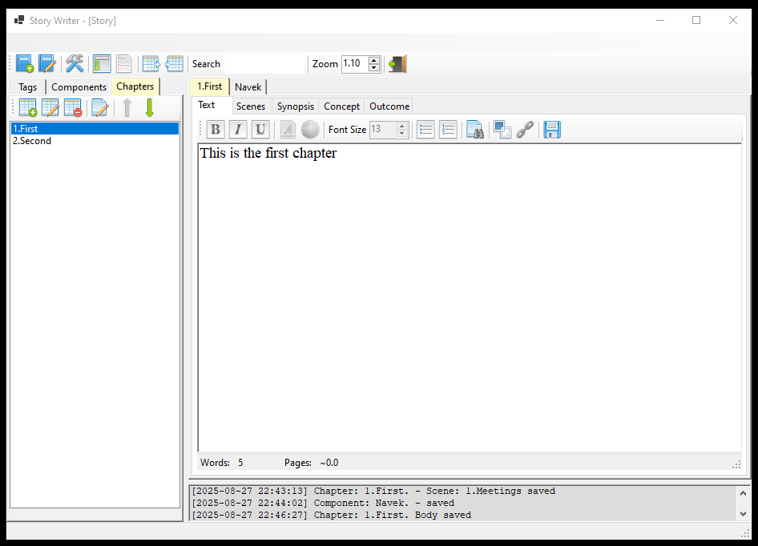

# tbStoryWriter

A lightweight Windows app that helps novelists plan, write, and organize long-form fiction.  

It combines a component tree (characters, locations, etc.), a chapter manager with reordering, a scene manager with reordering, and a focused tabbed editor for each chapter (Body, Scenes, Synopsis, Concept, Outcome).

> Status: Feature-complete for the current phase. More features can be added later.

## Why tbStoryWriter?

Long projects need structure **and** speed. tbStoryWriter gives you a left-hand sidebar to map your world, a chapter list you can rearrange in seconds, and a central editor that keeps each chapter’s materials (text, scenes, notes) together—no hunting through files.

## Components

**Components** are your world-building building blocks: user-defined entries (e.g., persons, locations, artifacts) organized in the left sidebar as a tree with **up to two levels of grouping**. 

You control the taxonomy—for example, *Person → Character/Historic* or *Location → Planet/Satellite/Continent/Country/City*.

You can freely add, rename, move, and re-order both groups and items to match your story’s structure. This keeps the universe tidy and navigable while you write.

A component like **Neris** (under *Person → Character*) or **Darky** (under *Location → Planet*) is always one double-click away, so you can maintain consistent names and details without hunting through files.

## Chapter Workspace (Tabbed)

Opening a chapter opens the following tabs:

- **Body** — The main chapter text
- **Scenes** — Add, edit, remove, and re-order scene cards within the chapter
- **Synopsis** — A compact summary for quick orientation
- **Concept** — The “idea core” of the chapter
- **Outcome** — What changes (plot/character/world) after this chapter

## Links and Quick Navigation

Think of tbStoryWriter as a lightweight wiki: press **Ctrl + Left-Click** on a selected word (or hit **Ctrl + L**) and the app searches **across all Components** as well as **chapter and scene titles**. 

If it finds a match, it opens that item instantly in a new editor tab, so you can jump from a mention in the text to the canonical entry (or chapter/scene) without losing your flow.


## App Settings
- **Auto-save** toggle
- **Load last project on startup**
- **Font family** and **font size** for the editor
- Settings UI: `AppSettingDialog` bound to:


```csharp
public class AppSettings {
    public bool LoadLastProjectOnStartup { get; set; } = true;
    public bool AutoSave { get; set; } = true;
    public string FontFamily { get; set; } = "Arial";
    public int FontSize { get; set; } = 14;
}
````

 
## Screenshots

Components


Chapters


 
## Requirements

* Windows 10/11
* .NET 9.0 SDK (or open with Visual Studio 2022 17.8+)

## Clone, Build, Run

```bash
git clone https://github.com/tbebekis/tb.StoryWriter.git
cd tb.StoryWriter
dotnet build
dotnet run --project StoryWriter.App/StoryWriter.App.csproj
```
 
## Exports

Currently the application can export a project/book to the following.

- RTF
- DOCX
- ODT

## Usage Notes

* **Projects**: tb.StoryWriter uses a Sqlite database file (default extension: `.db3`). Each project/book has its own database.
* **Chapters**: Add, edit, remove and reorder chapters. Double-click a chapter to open its editor tabs. Reorder, edit its body text, synopsis, concept, and outcome texts, add scenes, etc.
* **Scenes**: Maintain a per-chapter scene list. Add, edit, remove and reorder scenes.
* **Fonts**: Choose editor font family & size from *Settings → Editor*.
* **Auto-save**: Optional; can be toggled in settings.
* **Load last project**: Re-open your last project on startup if enabled.

## Roadmap Ideas

* Exports (Markdown)
* Graph view of relationships (characters ↔ locations ↔ chapters)


